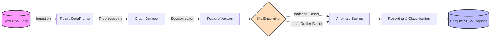

# 🕵️‍♂️ Web Log Anomaly Detection Pipeline


Повний Machine Learning пайплайн для аналізу HTTP-логів та виявлення аномальної активності без використання розмічених даних (Unsupervised Learning). Проєкт ефективно обробляє великі обсяги даних, виявляючи ботів, скрейпери, сканери вразливостей та brute-force атаки.

---

## ✨ Ключові особливості

- 🚀 **Memory-Efficient:** Обробка ~3.6 млн записів відбувається через `Polars` та формат `Parquet`, що дозволяє працювати з Big Data навіть на локальній машині.
- 🧠 **Unsupervised Ensemble ML:** Використання комбінації **Isolation Forest** та **Local Outlier Factor (LOF)** для максимальної точності.
- ⏱️ **Advanced Sessionization:** Динамічне групування запитів у сесії з вікном у 60 секунд для аналізу поведінкових патернів.
- 📊 **Готова аналітика:** Автоматична генерація звітів та класифікація виявлених загроз.

---

## 🏗 Архітектура Пайплайну

Проєкт побудований за класичною схемою ETL + ML. 



---

## 💾 Дані

Для навчання та тестування використовується відкритий датасет веб-логів:
- 📎 **Джерело:** [Zenodo - HTTP access logs](https://zenodo.org/records/3332970)
- **Період:** Січень–Лютий 2018
- **Обсяг:** ~3.6 млн записів після очищення

---

## 🚀 Getting Started (Швидкий старт)

### Передумови
Проєкт використовує сучасний пакетний менеджер [uv](https://github.com/astral-sh/uv) для надшвидкого управління залежностями.

### Встановлення та запуск

1. **Клонуйте репозиторій:**
   ```bash
   git clone https://github.com/paxawok/dnp_anomaly_detector.git
   cd web-log-anomaly-detection
   ```

2. **Встановіть залежності (за допомогою `uv`):**
   ```bash
   uv sync
   ```

3. **Запустіть пайплайн:**
   ```bash
   uv run python -m src.main
   ```

---

## 🧠 ML Підхід та Класифікація

Оскільки реальні логи рідко мають розмітку аномалій, ми використовуємо **Unsupervised Learning**. 
Моделі аналізують поведінкові фічі (кількість запитів у секунду, різноманітність URL, частка 4xx/5xx статусів тощо).

**Класифікатор загроз розподіляє аномалії за такими типами:**
* 🤖 `bot / crawler` — агресивне сканування з регулярними інтервалами.
* 🕷️ `web scraper` — викачування контенту (зосередження на конкретних ендпоінтах).
* 🔓 `brute-force / scan` — велика кількість помилок авторизації або 404 помилок.
* ❓ `unknown anomaly` — нестандартна поведінка, що потребує ручного рев'ю.

---

## 📈 Результати роботи

Після прогону пайплайну на повному датасеті були отримані наступні метрики:

> **Всього проаналізовано сесій:** `550,736`
> **Виявлено аномалій:** `~8.7%`

**Розподіл типів аномалій:**
| Тип загрози | Відсоток | Опис |
| :--- | :--- | :--- |
| **Bot / Crawler** | ~46% | Автоматизовані скрипти, пошукові боти без обмежень |
| **Unknown Anomaly**| ~28% | Атиповий трафік, який не підпадає під жорсткі правила |
| **Web Scraper** | ~25% | Цілеспрямований збір даних з сайту |
| **Brute-force** | ~1% | Спроби підбору паролів / сканування вразливостей |

---

## 📁 Структура проєкту та Артефакти

Після успішного запуску, пайплайн генерує артефакти у папку `data/processed/`:

```text
📦 data/processed/
 ┣ 📜 raw_logs.parquet         # Конвертовані сирі дані
 ┣ 📜 clean_logs.parquet       # Очищені та відфільтровані дані
 ┣ 📜 features.parquet         # Згенеровані фічі (вектори сесій)
 ┣ 📜 scored.parquet           # Дані з оцінками аномальності (anomaly scores)
 ┣ 📊 anomaly_report.csv       # Фінальний бізнес-звіт по загрозам
 ┣ 🧠 scaler.joblib            # Збережений об'єкт стандартизації
 ┣ 🧠 isolation_forest.joblib  # Навчена модель IF
 ┗ 🧠 secondary_model.joblib   # Навчена модель LOF
```